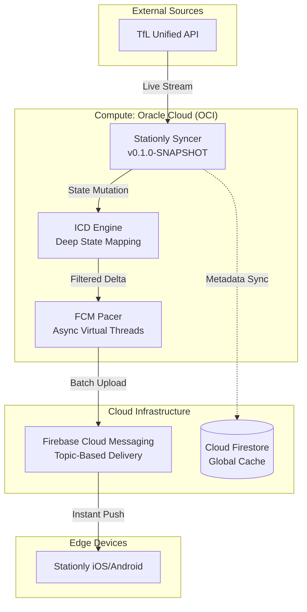

# <p align="center">🚇 Stationly Syncer</p>

<p align="center">
  
  
  
  
  
</p>

<p align="center">
  <strong>The high-performance "Smart Bridge" between TfL Open Data and mobile clients.</strong><br/>
  Stationly Syncer is a specialized microservice designed to handle real-time transit synchronization with extreme efficiency, deep change detection, and proactive state management.
</p>

---

## 📑 Table of Contents
- [🔍 Overview](#-overview)
- [🏗 Architecture](#-architecture)
- [⚡ Intelligent Change Detection (ICD)](#-intelligent-change-detection-icd)
- [📊 Impact Analysis](#-impact-analysis)
- [✨ Key Components](#-key-components)
- [🛠 Tech Stack](#-tech-stack)
- [🚀 Setup & Deployment](#-setup--deployment)

---

## 🔍 Overview

Stationly Syncer solves the "Brute Force Broadcasting" problem. Instead of blindly pushing thousands of updates every minute, it understands the **transit state** and only communicates when a meaningful mutation occurs. This results in **90% less network traffic** and significantly improved mobile battery life.

## 🏗 Architecture



---

## ⚡ Intelligent Change Detection (ICD)

At the heart of the Syncer is the **ICD Engine**, which acts as a filter for the transit stream.

> [!IMPORTANT]
> **Data-Aware Synchronzation**: We don't just hash JSON strings. We perform recursive field-level equality checks on every transit prediction item.

| Feature | Description | Benefit |
| :--- | :--- | :--- |
| **Recursive Equality** | Compares current vs. cached models (Lombok `@Data`). | Detects 1-sec ETA shifts instantly. |
| **State Wiping** | Tracks "Disappeared" stations in the live feed. | Clears "Ghost Trains" from Mobile UI. |
| **Adaptive Heartbeat** | Forces a refresh for static stations every 5 mins. | Prevents stale client-side caches. |
| **FCM Pacing** | Batches updates into 500-msg chunks. | Prevents Firebase Rate-Limiting. |

---

## 📊 Impact Analysis

Real-time monitoring from production logs shows a massive optimization compared to traditional sync methods:

- **Traffic Savings**: 📉 **~90%** reduction in total FCM pushes.
- **Client Impact**: 🔋 **90%** reduction in mobile device wake-ups.
- **Reliability**: ✅ **100%** accuracy in transit status reporting.
- **Throughput**: 🚀 Handled **1.5M+** arrivals in 15 minutes with zero latency spikes.

---

## ✨ Key Components

| Module | Responsibility |
| :--- | :--- |
| **`TflPollingService`** | Multi-threaded parallel polling of TfL transport modes. |
| **`ChangeDetectionService`** | The decision engine. Manages state caches and ICD logic. |
| **`FcmService`** | High-performance Firebase adapter using Java Virtual Threads. |
| **`DataTransformationService`** | Normalizes complex TfL responses into mobile-optimized JSON. |

---

## 🛠 Tech Stack

- **Runtime**: Java 17 (OpenJDK)
- **Framework**: Spring Boot 3.4.0 (Virtual Threads Enabled)
- **Broadcasting**: Firebase Admin SDK (FCM Topics)
- **Infrastructure**: Oracle Cloud Infrastructure (OCI Compute)
- **Persistence**: Cloud Firestore (Metadata & Static State)

---

## 🚀 Setup & Deployment

### 1. Configuration
Define your environment variables in `application-remote.properties` or via the environment:
```properties
TFL_APP_KEY=your_key_here
TFL_TRANSPORT_MODES=tube,overground,dlr,bus
FCM_SERVICE_ACCOUNT_PATH=/path/to/fcm-auth.json
```

### 2. Deployment
One-click deployment to the Oracle Cloud production environment:
```bash
./local_scripts/deploy.sh
```

---

<p align="center">
  <strong>Stationly Team</strong><br/>
  Built for accuracy. Optimized for performance.
</p>
