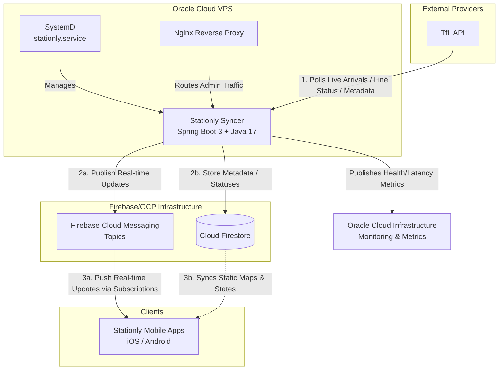

# Stationly Syncer

A high-performance Spring Boot background worker that synchronizes real-time public transit data from Transport for London (TfL) and broadcasts it directly to mobile clients using Firebase Cloud Messaging (FCM) and Cloud Firestore.

---

## 🏗 Architecture



## ✨ Core Features

1. **Real-Time Arrivals Broadcaster**: Continuously polls the TfL API for train/bus arrivals, parses the data, groups it by station, and broadcasts the payloads instantly to actively listening devices via Firebase Cloud Messaging topics.
2. **Station Metadata Synchronizer**: Runs scheduled background updates to keep Cloud Firestore synchronized with the latest underlying TfL transit network structure, geographic locations, and transport lines.
3. **Live Line Status Tracker**: Fetches detailed realtime disruption and delay data across all TfL lines and stores reasons/severities in Firestore for the app to consume.
4. **OCI Metrics Integration**: Formats and ships performance metrics such as polling latency and update sizes to Oracle Cloud Infrastructure (OCI) Monitoring.

## 🛠 Tech Stack

- **Java 17** & **Spring Boot 3.4.0**
- **Firebase Admin SDK** (FCM & Firestore)
- **Oracle Cloud Infrastructure SDK** (Custom Monitoring)
- **Geohash** (Location-based clustering)

---

## 🚀 Getting Started

### Prerequisites

- Java 17+
- Maven 3.8+
- Firebase service account credentials (`.json`)
- TfL API key (For bypassing rate limits)

### Environment Variables

| Variable | Description |
|----------|-------------|
| `TFL_APP_KEY` | TfL API authentication key |
| `TFL_TRANSPORT_MODES` | Comma-separated transport modes (e.g. `tube,overground,dlr`) |
| `TFL_POLLING_INTERVAL` | Polling interval in ms (Default: `30000`) |
| `FCM_SERVICE_ACCOUNT_PATH` | Path on the server/local to Firebase config file |
| `FIRESTORE_PROJECT_ID` | Specific Firebase project identifier |
| `OCI_MONITORING_ENABLED` | Enable Oracle Cloud metrics (`false` by default) |
| `OCI_MONITORING_COMPARTMENT_ID` | Oracle Cloud Compartment ID |

### Running Locally

```bash
# Export the necessary environment variables
export TFL_APP_KEY="your-tfl-key"
export FCM_SERVICE_ACCOUNT_PATH="path/to/firebase-sdk.json"

# Run with local profile utilizing Maven
mvn spring-boot:run -Dspring-boot.run.profiles=local
```

### Build Executable JAR

```bash
mvn clean package -DskipTests
```

---

## 🚢 Deployment

Deployment is completely automated for Oracle Cloud Infrastructure (VPS) using a combination of SSH and a Bash script. 

To deploy changes to the live server:
```bash
./local_scripts/deploy.sh
```

**How the deployment script works:**
1. Triggers `./local_scripts/build.sh` to package a clean Java 17 JAR.
2. Merges the safe `application-remote.properties` with developer credentials.
3. Securely copies the artifact (`stationly_syncer.jar`) via SCP to the remote Ubuntu host.
4. Reloads the SystemD daemon (`stationly.service`) and bounces the application.

*Nginx configuration details, proxy rules, and SystemD configurations can currently be found in the `./server-config/` directory.*

## 📚 API / Admin Capabilities
While Stationly Syncer primarily works entirely in the background, there is an interactive Swagger / OpenApi interface exposed for manually triggering Sync cycles and checking health.

- **Local**: `http://localhost:8080/StationlySyncer/docs`
- **Production**: `https://api.stationly.co.uk/StationlySyncer/docs`

---
**License**: Apache 2.0  
**Contact**: support@stationly.co.uk
